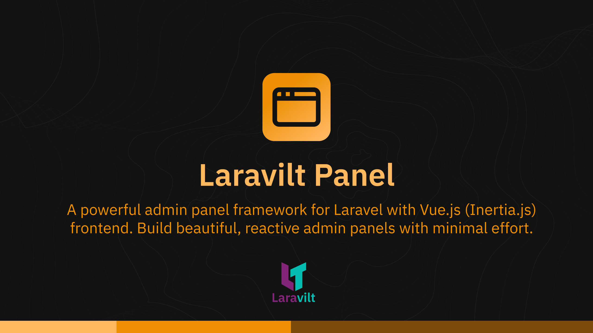

# Panel Plugin for Laravilt

[](https://packagist.org/packages/laravilt/panel)
[](https://packagist.org/packages/laravilt/panel)
[](https://packagist.org/packages/laravilt/panel)

A powerful admin panel framework for Laravel with Vue.js (Inertia.js) frontend. Build beautiful, reactive admin panels with minimal effort.

## Features

- **Resources**: Auto-generate CRUD interfaces from database tables
- **Pages**: Custom standalone pages with full control
- **Clusters**: Group related pages under a common navigation section
- **API Generation**: RESTful API endpoints with interactive API Tester
- **Forms**: Dynamic form builder with 30+ field types
- **Tables**: Feature-rich data tables with filtering, sorting, and bulk actions
- **Infolists**: Display record details in elegant layouts
- **Actions**: Customizable actions with modal support
- **Navigation**: Auto-generated navigation with groups and badges

## Installation

```bash
composer require laravilt/panel
```

The package will automatically register its service provider.

## Configuration

Publish the config file:

```bash
php artisan vendor:publish --tag="laravilt-panel-config"
```

## Quick Start

### 1. Create a Panel

```bash
php artisan laravilt:panel admin
```

This creates a new admin panel at `app/Providers/Laravilt/AdminPanelProvider.php`.

### 2. Create a Resource

```bash
php artisan laravilt:resource admin
```

Follow the interactive prompts to:
- Select a database table
- Choose which columns to include
- Enable API endpoints (optional)
- Enable API Tester interface (optional)

### 3. Create a Page

```bash
php artisan laravilt:page admin Dashboard
```

Creates a standalone page with both PHP controller and Vue component.

### 4. Create a Cluster

```bash
php artisan laravilt:cluster admin Settings --icon=Settings
```

Creates a cluster to group related pages:

```php
// app/Laravilt/Admin/Clusters/Settings.php
class Settings extends Cluster
{
    protected static ?string $navigationIcon = 'Settings';
    protected static ?string $navigationLabel = 'Settings';
}
```

Assign pages to a cluster:

```php
class ProfilePage extends Page
{
    protected static ?string $cluster = Settings::class;
}
```

## API Generation

Resources can automatically generate RESTful API endpoints.

### Enable API on a Resource

Simply define an `api()` method on your resource - the API will be auto-detected:

```php
class ProductResource extends Resource
{
    public static function api(ApiResource $api): ApiResource
    {
        return ProductApi::configure($api);
    }
}
```

### API Configuration Class

```php
class ProductApi
{
    public static function configure(ApiResource $api): ApiResource
    {
        return $api
            ->columns([
                ApiColumn::make('id')->type('integer')->sortable(),
                ApiColumn::make('name')->searchable()->sortable(),
                ApiColumn::make('price')->type('decimal'),
                ApiColumn::make('created_at')->type('datetime'),
            ])
            ->useAPITester(); // Enable interactive API tester UI
    }
}
```

### API Tester Interface

Enable the API Tester UI to allow interactive API testing directly from the panel:

```php
$api->useAPITester(); // Enable
$api->useAPITester(false); // Disable (default)
```

### Available API Methods

```php
$api
    ->columns([...])           // Define API columns
    ->endpoint('/api/products') // Custom endpoint
    ->perPage(25)              // Items per page
    ->authenticated()          // Require authentication
    ->list(enabled: true)      // Enable/disable list operation
    ->show(enabled: true)      // Enable/disable show operation
    ->create(enabled: true)    // Enable/disable create operation
    ->update(enabled: true)    // Enable/disable update operation
    ->delete(enabled: true)    // Enable/disable delete operation
    ->useAPITester();          // Enable API Tester interface
```

## Commands

| Command | Description |
|---------|-------------|
| `laravilt:panel {name}` | Create a new panel |
| `laravilt:resource {panel}` | Create a resource with interactive prompts |
| `laravilt:page {panel} {name}` | Create a standalone page |
| `laravilt:cluster {panel} {name}` | Create a cluster for grouping pages |
| `laravilt:relation {panel} {resource} {name}` | Create a relation manager |

### Cluster Command Options

```bash
php artisan laravilt:cluster admin Settings \
    --icon=Settings \
    --sort=10 \
    --group="System"
```

## Resource Structure

```
app/Laravilt/Admin/Resources/Product/
├── ProductResource.php      # Main resource class
├── Form/
│   └── ProductForm.php      # Form configuration
├── Table/
│   └── ProductTable.php     # Table configuration
├── InfoList/
│   └── ProductInfoList.php  # Infolist configuration
├── Api/
│   └── ProductApi.php       # API configuration (optional)
└── Pages/
    ├── ListProduct.php      # List page
    ├── CreateProduct.php    # Create page
    ├── EditProduct.php      # Edit page
    └── ViewProduct.php      # View page
```

## Testing

```bash
composer test
```

## Code Style

```bash
composer format
```

## Static Analysis

```bash
composer analyse
```

## License

The MIT License (MIT). Please see [License File](LICENSE.md) for more information.
